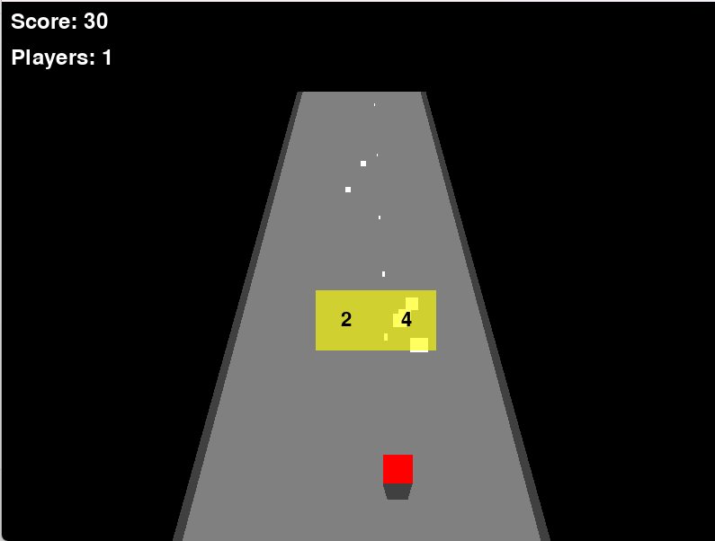

# 3D Scrolling Shooter

A retro-style pseudo-3D scrolling shooter game where you control multiple player instances and face waves of enemies.

## How to Play

### Controls
- **Left Arrow**: Move player(s) left
- **Right Arrow**: Move player(s) right  
- **Space**: Fire projectiles
- **Up/Down Arrows**: Navigate menu options (when game over)
- **Enter**: Select menu option (when game over)

### Gameplay
1. You start with a single player instance
2. Move left and right to dodge enemies and collect powerups
3. Shoot enemies to score points (10 points per enemy)
4. Collect numbered powerups to change your player count:
   - Positive numbers (+1 to +5) add more player instances
   - Negative numbers (-1 to -5) remove player instances
   - You need at least 1 player instance to stay alive
5. Multiple player instances move in a circular formation
6. Each player instance can shoot independently
7. If any player instance collides with an enemy, you lose that instance
8. Game ends when you lose all player instances

## Technical Implementation Details

### Display Settings
- Window Size: 800x600 pixels
- Pseudo-3D road perspective with horizon at y=100
- Road width varies from 400 pixels at bottom to 133 pixels at horizon

### Player Mechanics
- Base Size: 40x40 pixels
- Starting Position: Centered horizontally, 80 pixels from bottom
- Movement Speed: 5 pixels per frame
- Multiple instances arranged in concentric circles
- Circle radius: 1/6 of road width at bottom

### Projectile System
- Base Size: 8x15 pixels
- Speed: 7 pixels per frame upward
- Fired from each player instance independently
- Maintains perspective-correct movement

### Enemy System
- Base Size: 30x30 pixels
- Speed: 2 pixels per frame downward
- Spawn Rate: Every 60 frames
- Spawn in clusters of 2-5 enemies
- Track player movement with smooth transitions
- Speed increases as they get closer to bottom

### Powerup System
- Base Size: 50x50 pixels
- Speed: 2 pixels per frame downward
- Spawn Rate: Every 300 frames
- Always spawn in pairs
- Values range from -5 to +5
- Flash effect with 10-frame interval
- Take up exactly 1/4 of road width each

### Visual Effects
- Perspective scaling based on y-position
- Road with side barriers
- Player shadows
- Semi-transparent powerups
- Flashing numbers on powerups

### Game States
- Playing state
- Game Over state with menu options
- Score tracking
- Player instance counter

### Performance
- 60 FPS target
- Frame counter cycles every 3600 frames
- Perspective calculations for smooth motion

### Technical Notes
- Uses Pygame library
- Collision detection with perspective scaling
- Dynamic object scaling based on y-position
- Normalized x-coordinates for perspective accuracy
- Memory management with object cleanup

## Requirements
- Python 3.x
- Pygame library
